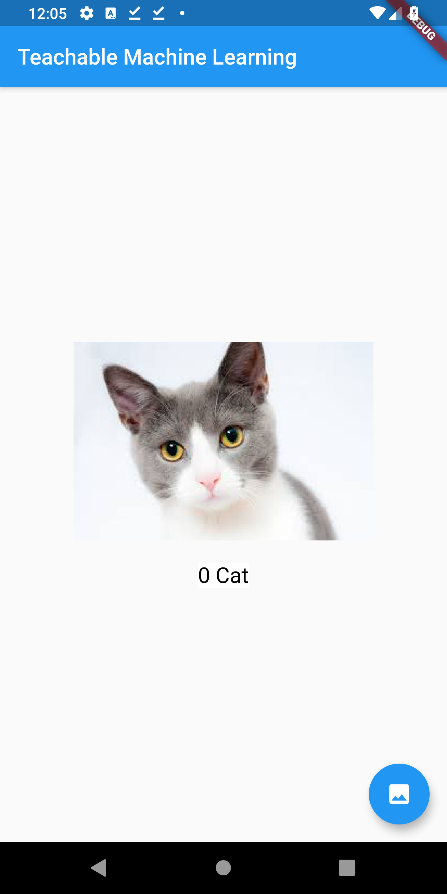

# flutter_teachable_ml

Example of generating the classic dog vs cat classifier using [Teachable Machine Learning](https://teachablemachine.withgoogle.com/) and integrate in Flutter.

## Screenshots
&nbsp;&nbsp;&nbsp;&nbsp;&nbsp;&nbsp;&nbsp;&nbsp;&nbsp;&nbsp;&nbsp;&nbsp;&nbsp;&nbsp;&nbsp;&nbsp;
